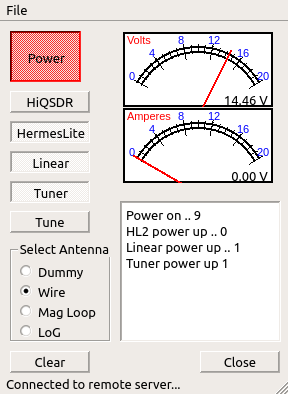
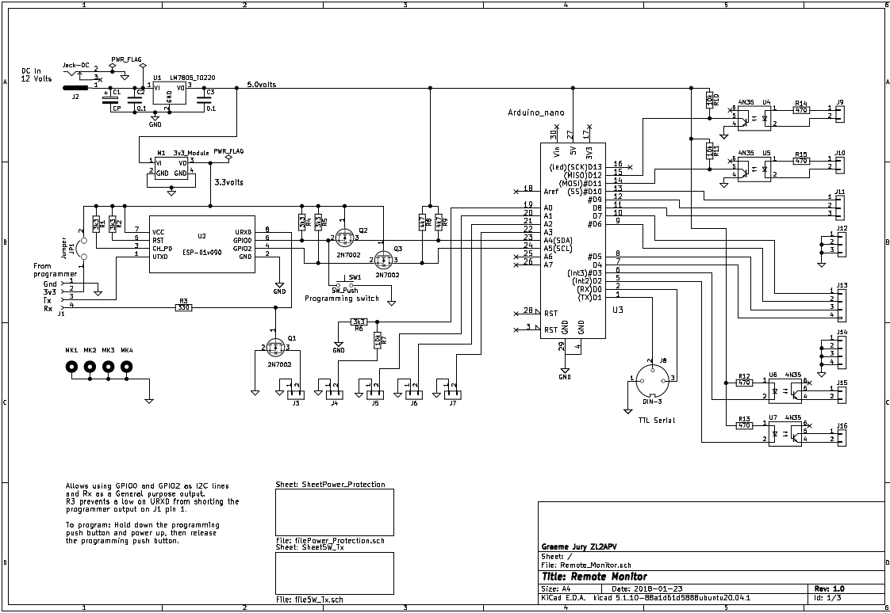

# QtRemote

QtRemote is a client to switch on and off equipment in a remotely placed location with a computer placed anywhere in the local LAN. In my case my station is located in the garage and I operate from a spare bedroom in the house. The server which is located in the garage where my ham gear is consists of an ESP01 to provide a wireless connection and is coupled to an Arduino via I2C which is fed the commands from the QtRemote client via the ESP01. The Arduino echos the received command back to the QtRemote client and where the command asks for data like the shack voltage, also returns that.

In this repository you can find the code for the server which is in two separate units for the ESP01 and the Arduino nano plus the Kicad files for the PCB layout. I have shown the circuit diagram below for your reference.

remoteESP-01
remoteArduino
Remote_Monitor

